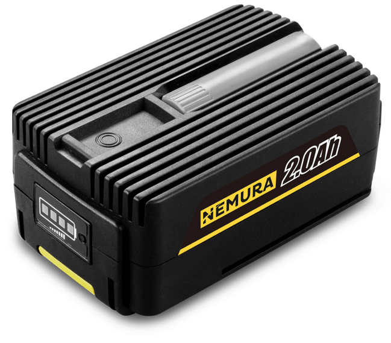
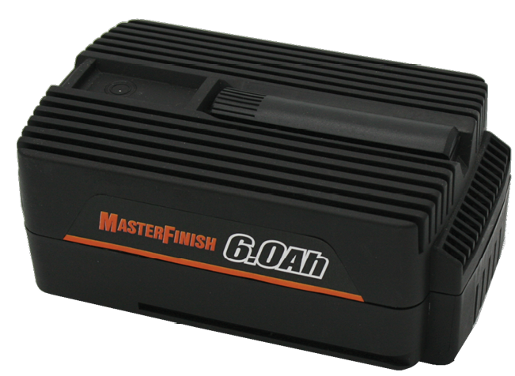
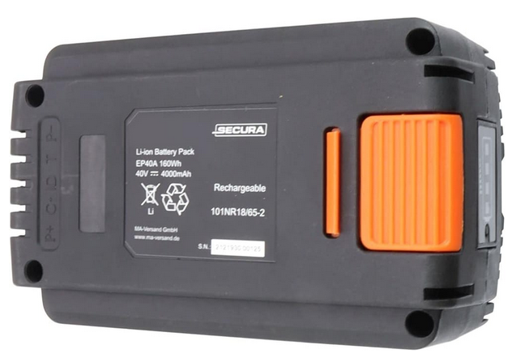

# EP-40V-Battery-Reverse
**Reverse engineering, schematics, fault findings and repair tips** related to the **EPxx** familly, **40V**, garden multi-tool **battery** packs, manufactured by **Ningbo NGP Industry Co., Ltd.**.
These packs are distributed under various brand names.
*([source](http://www.redbackpower.com/index.php?route=common/about)\)*  
If your battery resemble the images below, you are at the right place.

  
  

---

## 🏷️ Applicability (brands, models)

### Brands

Known brands distributing these battery packs:  
**[redback](Photos/Brands/redback.png)**, **[NEX](Photos/Brands/NEX.png)**, **[NEMURA](Photos/Brands/nemura.png)**, **[FUXTEC](Photos/Brands/fuxtec.png)**, **[Liforce](Photos/Brands/Liforce.png)**, 
**[OOGarden](Photos/Brands/oogarden.png)**, **[TIMBERPRO](Photos/Brands/timberpro.png)**, **[Riwall](Photos/Brands/Rewall.png)**, **[ZIPPER](Photos/Brands/zipper.png)**, **[GT ELEC](Photos/Brands/GT_ELEC.png)**,
**[PATRIOT](Photos/Brands/patriot.png)**, **[MIOGARDEN](Photos/Brands/MIOGARDEN.png)**, **[MasterFinish](Photos/Brands/MasterFinish.png)**, **[SECURA](Photos/Brands/secura.png)**

### Models

* **EP20** and **EP20A** : Li-ion 40v battery, **2Ah**
* **EP40** and **EP40A** : Li-ion 40v battery, **4Ah**
* **EP60** and **EP60A** : Li-ion 40v battery, **6Ah**
* **EP90** and **EP90A** : Li-ion 40v battery, **9Ah**

---

## 🛠️ Technical Overview & Architecture

### Official Specs
*([source](https://www.cccme.cn/products/detail-8237768.aspx)\)*

|                   | EP20           | EP40           | EP60           |  EP90          |
| :---              | :---           | :---           | :---           | :---           |
| Battery Cell      | Li-ion Samsung | Li-ion Samsung | Li-ion Samsung | Li-ion Samsung |
| Battery Power     | 80Wh           | 160Wh          | 240Wh          | 360Wh          |
| Battery Voltage   | 40V            | 40V            | 40V            | 40V            |
| Battery Capacity  | 2Ah            | 4Ah            | 6Ah            | 9Ah            |
| Charging Time\*    | 62/39 mins     | 114/69 mins    | 186/84 mins    | 300/140 mins   |
| Net Weight        | 0.9kg          | 1.30kg         | 1.75kg         | 1.85kg         |

\* slow/fast (charger EC20/EC50)

### Cells

* **Cells Configuration:**
  * **EP20** and **EP20A** : 10 x 3.7v **2000mAh** 18650 cells, **10s1p** architecture (x10 in series)  
  * **EP40** and **EP40A** : 20 x 3.7v **2000mAh** 18650 cells, **10s2p** architecture (x10 in series, x2 in parallels)  
  * **EP60** and **EP60A** : 30 x 3.7v **2000mAh** 18650 cells, **10s3p** architecture (x10 in series, x3 in parallels)  
  * **EP90** and **EP90A** : 30 x 3.7v **3000mAh** 18650 cells, **10s3p** architecture (x10 in series, x3 in parallels) *(tbc)*
* **Cells Brands and Models:**
  * Models without suffix (EPxx) are supposely equiped with **Samsung** cells \([EP40 example](Photos/EP40_cells.jpg)\). Cells confirmed so far:
    * [Samsung INR18650-20R](Photos/INR18650-20R.png) (found in: NEX EP20, OOGarden EP40) -- *[datasheet](Docs/datasheets/INR18650-20R%20Samsung.pdf)*
  * Models identified with a "**A**" suffix (EPxx**A**) are supposely equiped with other cell brands \([EP60A example](Photos/EP60A_cells.jpg)\). Cells confirmed so far:
    * [SunPower INR18650-2000](Photos/INR18650-2000.png) (found in: NEX EP60A) -- *[datasheet](Docs/datasheets/INR18650-2000%20SunPower.pdf)*

### BMS Controller
 Composed of **two [CW1051](Docs/datasheets/CW1051.pdf) or equivalent** secondary protection ICs configured in **Cascade Mode**.
  * **U2 (Bottom IC):** Monitors 1st to 5th (`B1` to `B5`) cells / parallel group of cells.
  * **U1 (Top IC):** Monitors 6th to 10th (`B6` to `B+`) cells / parallel group of cells.

### Safety & Charge Logic (ID Pin)
The battery pack communicates its status to the charger via the **ID** terminal. The system uses an **Active-High** logic configuration for the protection ICs' `CO` (Charge Output) on pins 8:
  * **Normal Operation (No Fault):** Both `U1` and `U2` maintain their `CO` pins at their respective **Low** state (VSS).
    * This turns ON the PNP transistor `Q1` while blocking the NPN transistor `Q3`, allowing `R15` to pull up the gate of the MOSFET `Q2`.
    * As a result, `Q2` **is turned ON and pulls the ID terminal line directly to Ground (B-)**, signaling the charger that the pack is healthy and ready to charge.
  * **Fault Detected (Overcharge/OVP):** If *either* IC detects a fault, its `CO` pin drives **High** (VDD).
    * If `U1` triggers, it turns OFF `Q1`, cutting off the gate voltage for `Q2`.
    * If `U2` triggers, it turns ON `Q3`, which immediately grounds the gate of `Q2`.
    * In both cases, `Q2` **turns OFF, releasing the ID line**. The charger senses the ID line floating (high impedance) and immediately aborts or refuses to initiate charging.
  * [**Circuit Simulation**](https://falstad.com/circuit/circuitjs.html?ctz=DwYwlgTgBAZgvAIgIwKgFwM6IAwDpsEECsqYIiSeATAVQOx0DM2AHFQGwCcndqIARoiLZUAB0EJhqAG4QhqALaYhAUwC0SFAD4AUFCjA0UAB6J2RdlCJUWUJpestU8BFTEA7Cqn4qKUqAoA9ogAJiowAIYArgA2aDI+OLgALPScrEx0RERIyZzsSLxQ0vzkCHjJyUQs2EzJjFksRJx5CAD0uvqGJoh02MlQ9FR2LANDzohuUKKeCBrevsgEisEIYZGx8cWJCIxEuJwsmul07MmsLGcJZWp4hEgsLNzsL9asL-Ts7Z0GMD0Io1sOWGnCQw2BE12U2kaAouBIUB2dzcHT0BmgpgQdFGUHqw2xAwhsBwqDkS0IhG+aOAGN6OOBI0JnCmLhEUDJwgpIlRXQA7v8CVYwVBAUKWSSeQYAOYC+nMxlQdhUZKQ7k-YAyzGg8E2KDaxXK1VUvmywnC+xio2S4D8zGCmy2QV4q3q2kIcwOXUeqzMo3sihc5bWzVmCw+4bepUq4nlY3ogX9QZ0fGJmhOGNssmUQNxm0JsasBVpl3UkNYxgOSp2CsG6Os3MYf6Mem65tM8Wx6Zea2NzFtpPDfuMCt+0Td13-b2OcNWGx+rOBtXUt19MbJxXnAfzgM560AJVNg0LgqQ7DZLlPqF59YCEWM0kQI+tbv1eUsr8vGdJO6XXQPWuFZJTz1YU20hT9rxJW973kYMmzlQccSjEsujdfshigfskF9L9-XJClczQltbH7Sp0xvBcuVzW0hHlad+0cFCDBo91Nww9DkyYvM7RxNMiwsLj-0fHFsMQgZT3PCgvigSDOwUO8H12L593ggZzmwTDrFxZYYwgm95Jg5AnGtFjSIITCcTIrjTJxYdLDMyTY1RYA2nACBdCAA)
(turn on/off switches to simulate ICs CO outputs).
  * The **ID** line is fully protected against static discharges and voltage spikes by a transient voltage suppressor diode (`TVS1`) and a filtering capacitor (`C11`).

### Thermal Protection (T Pin)
The battery pack safety design includes a temperature monitoring loop via the **T** terminal:
  * A **NTC thermistor** (`TC1`) is physically taped to the cells.
  * The **T** line is directly exposed to the charger and the power tool. The external charger monitors the voltage divider created by `TC1`.
  * If the cell temperature spikes too high (during heavy use or fast charging) or drops below freezing, the resistance of `TC1` shifts dramatically. The charger detects this voltage swing and immediately stops operation to prevent thermal runaway.
  * The line is fully protected against static discharges and voltage spikes by a transient voltage suppressor diode (`TVS2`) and a filtering capacitor (`C15`).

### Overcurrent Protection
Managed by an heavy duty fuse between `B+` and `P+/C+`.

### PCB
A two layers SMT [PCB](Photos/EP20_PCB.jpg). All the components and most of the traces are on the accessible (bottom) side. A thin layer of conformal coating is applied over the SMD components.

### Charge indicator LED module
Directly wired to `P+/C+` and `B-/P-/C-`. Looks like a basic 4 LEDs voltage indicator. *TBC*

### Enclosure
A two parts platic (polypropylene?) case secured with x4 T15 screws. 

---

## 📋 Bill of Materials (BOM)
Based on the reverse-engineered [schematic](Schematics/EP-batt-BMS_schematic.pdf), here are the main active and passive components used in the control circuit:

| Designator | Qty | Component / Value | Description |
| :--- | :---: | :--- | :--- |
| **U1, U2** | 2 | *Unknown\*\** | Battery Protection IC |
| **Q1** | 1 | [MMBT5401](Docs/datasheets/MMBT5401-D.PDF) | PNP Transistor |
| **Q2** | 1 | [2N7002](Docs/datasheets/NDS7002A-D.PDF) | N-Channel MOSFET |
| **Q3** | 1 | [MMBT3904](Docs/datasheets/MMBT3904LT1.PDF) | NPN Transistor |
| **DZ1, DZ2** | 2 | [PDZ27B](Docs/datasheets/PDZ-B_SER.pdf) | Zener Diode |
| **TVS1, TVS2**| 2 | [SMAJ20A](Docs/datasheets/SMAJ_Series.pdf) | Transient Voltage Suppressor |
| **TC1** | 1 | 10 KΩ NTC | Thermistor |
| **R1, R9, R11, R20**| 4 | 100 Ω | Resistor (act as protection fuse) |
| **R2, R4, R15, R16, R23** | 5 | 10 MΩ (1%) | Resistor |
| **R22** | 1 | 4.99 MΩ (1%) | Resistor |
| **R3, R5, R6, R7, R8, R10, R12, R14, R17, R21** | 10 | 1 KΩ (1%) | Resistor |
| **R13** | 1 | 16.2 KΩ | Resistor |
| **R18** | 1 | 100 KΩ | Resistor |
| **R19** | 1 | 10 KΩ | Resistor |
| **C1 to C13, C15, C16** | 15 | *Undetermined* | Ceramic Capacitor |

\*\* Unreadable chip marking (obliterated). MSOP-8 package.
The pinout fully matches [CellWise CW1051](Docs/datasheets/CW1051.pdf) (active high), or equivalent like [hlec SIT1051](https://www.hlec.net/SIT1051-2nd-Battery-Protection-CW1051.html) or [SGMICRO SGM41050](Docs/datasheets/SGM41050.pdf). Please advise if anybody determined it accuratly.

---

## 🔍 Common Faults & Troubleshooting Tips

Coming soon...

---

## 📂 Repository Structure
* `/Docs` : Manuals, datasheets, etc.
* `/Photos` : High-resolution images of the batteries, PCB, cells, etc.
* `/Schematics` : Full schematics in high-quality PDF.

---

*Feel free to open an Issue or a Pull Request if you have any question, comment or correction!*
